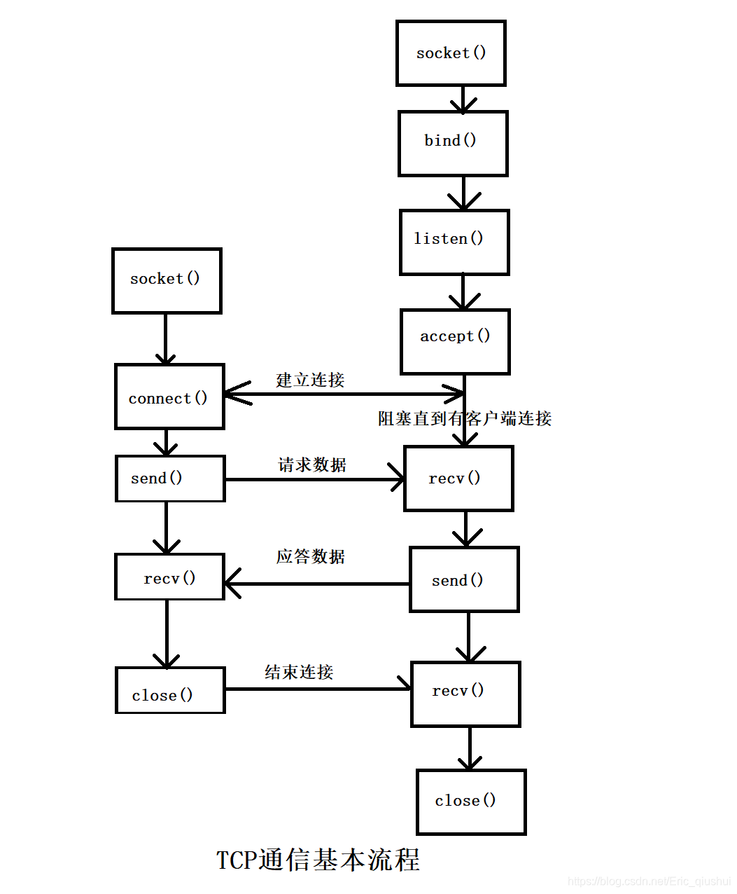

# TCP服务端

## 进入等待连接请求状态

```C
#include <sys/socket.h>

int listen(int sock, int backlog);

/**
 * sock:    希望进入等待连接请求状态的套接字文件描述符
 * backlog: 连接请求等待队列的长度
*/
```

成功则返回0，失败则返回-1

## 受理客户端连接请求

```C
#include <sys/socket.h>

int accept(int sock, struct sockaddr *addr, socklen_t *addrlen);
/**
 * sock:    服务器套接字的文件描述符
 * addr:    保存发起连接请求的客户端地址信息的变量地址值，调用函数后向传递来的地址变量参数填充客户端地址信息
 * addrlen: 第二个参数addr结构体的长度
*/
```

成功则返回创建的套接字文件描述符，失败则返回-1

# TCP客户端

## 请求连接

```C
#include <sys.socket.h>

int connect(int sock, struct sockaddr *servaddr, socklen_t addrlen);
/**
 * sock:    服务器套接字的文件描述符
 * addr:    保存目标服务器端地址信息的变量地址值
 * addrlen: 第二个参数servaddr结构体的长度
*/
```
成功则返回0，失败则返回-1


# 基于TCP的服务端/客户端函数调用关系



该图总体流程如下：服务器端创建套接字后调用`bind`、`listen`函数进入等待状态，客户端通过调用`connect`函数发起连接请求。需注意的是，客户端只能等到服务器端调用`listen`函数后才能调用`connect`函数。同时要清楚，客户端调用`connect`函数前，服务器端有可能率先调用`accept`函数。当然，此时服务器端在调用`accept`函数时进入阻塞（blocking）状态，知道客户端调用`connect`为止。
