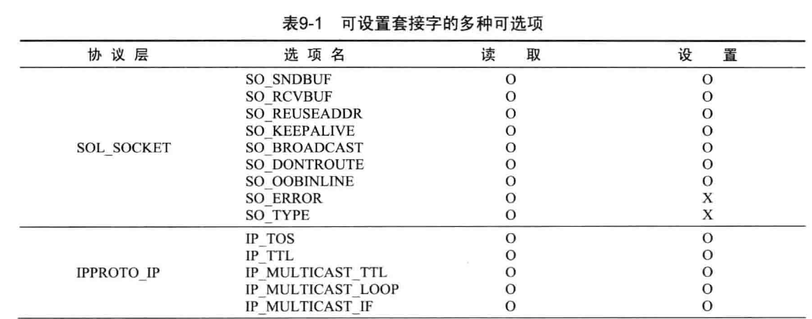
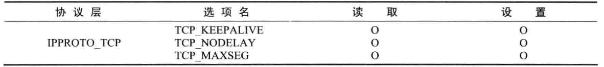

# 套接字的多种可选项

## 套接字的多种可选项

套接字可选项分为`IPPROTO_IP`、`IPPROTO_TCP`、`SOL_SOCKET`三层，各层的含义为：
1. `IPPROTO_IP`：IP 协议相关事项；
2. `IPPROTO_TCP`：TCP 协议相关事项；
3. `SOL_SOCKET`：套接字相关的通用可选项。




## `getsockopt` & `setsockopt`

```C
#include <sys/socket.h>

int getsockopt(int sock, int level, int optname, void *optval, socklen_t *optlen);
/**
 * sock:    要查看的套接字文件描述符
 * level:   要查看的可选项的协议层
 * optname: 要查看的可选项名
 * optval:  保存查看结果的缓冲地址值
 * optlen:  第四个参数`optval`传递的缓冲区大小
*/

int setsockopt(int sock, int level, int optname, void *optval, socklen_t *optlen);
/**
 * sock:    用于更改可选项的套接字文件描述符
 * level:   要更改的可选项的协议层
 * optname: 要更改的可选项名
 * optval:  保存要更改的选项信息的缓冲地址值
 * optlen:  第四个参数`optval`传递的缓冲区大小
*/
```

成功时返回0，失败则返回-1

