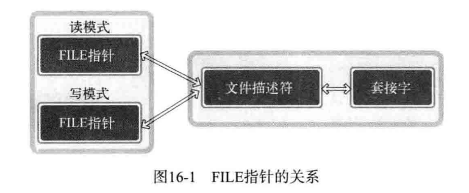
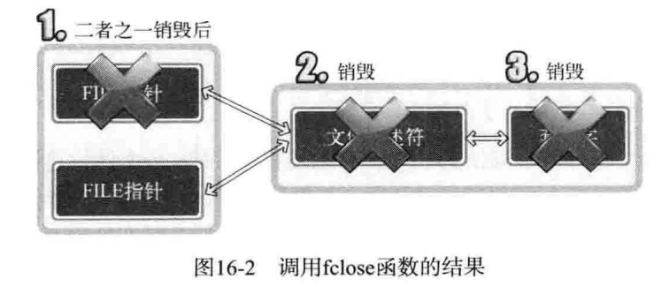
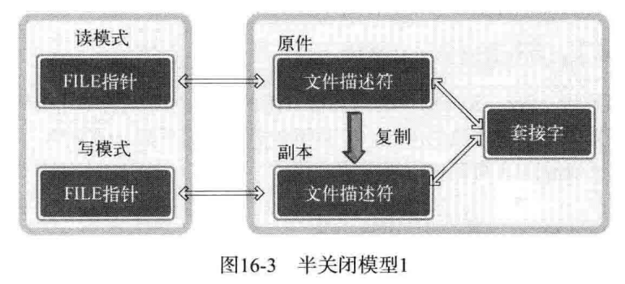
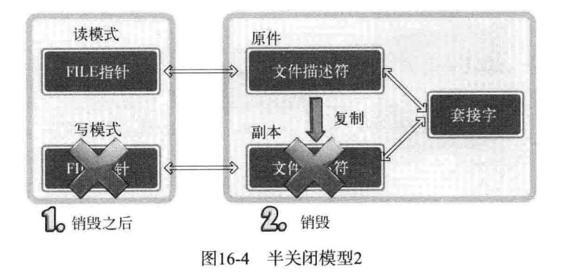
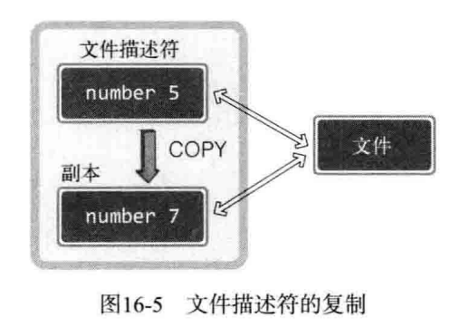

## 文件描述符的半关闭





针对任意一个`FILE`指针调用`fclose`时都会关闭文件描述符，也就是终止套接字



要销毁所有文件描述符后才能销毁套接字



此时调用`fclose`后还剩一个文件描述符，因此没有销毁套接字。然而，并不意味着进入了**半关闭状态**，这只是准备好了半关闭的环境。要进入真正的半关闭状态需要进行特殊处理。


## 文件描述符的复制



```C
#include <unistd.h>

int dup(int fildes);
int dup2(int fildes, int fildes2);
/**
 * fildes:  需要复制的文件描述符
 * fildes2: 明确指定的文件描述符整数值
*/
```

成功则返回复制的文件描述符，失败则返回`-1`

`dup2`函数的`fildes2`，想起传递大于0且小于进程能生成的最大文件描述符值时，改制将成为复制后得到的文件描述符值。[example](./dup.c#L12)

