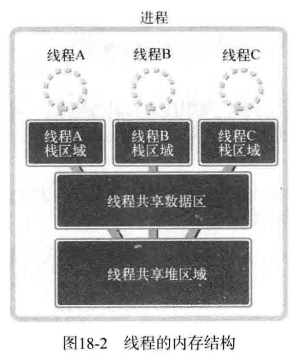

## 线程概念

多进程模型的缺点：
1. 创建进程的开销大。
2. 进程间通信困难。
3. 进程切换开销大（最主要的缺点）。

由于进程的以上缺点，引入了线程。

线程相比进程的优点：
1. 创建线程更快。
2. 线程间通信方便快捷。
3. 线程切换开销小。




## 线程创建及运行

[Example](./thread1.c)

**功能**：创建线程并设置该线程的入口函数，然后运行该线程

```C
#include <pthread.h>

int pthread_create(
    pthread_t *restrict thread, const pthread_attr_t *restrict attr,
    void  *(* start_routinue)(void *), void *restrict arg
);
/*
`thread`：          用于保存新创建的线程`ID`；
`attr`：            用于传递线程属性，当`attr`值为`NULL`，创建默认属性的线程；
`start_routine`：   相当于线程的`main`函数； 
`arg`：             传递`start_routine`函数的参数信息。
*/
```
返回值：成功时返回`0`，失败时返回其他值。

**`restrict`关键字**

`restrict`是`C99`引入的一种类型限定符，它告诉编译器，对象已经被指针所引用，不能通过除该指针外所有其他直接或间接的方式修改该对象的内容。

**注意**：由于`pthread`库不是`Linux`系统默认的库，链接时需要使用静态库`libpthread.a`，所以当使用了线程相关的函数后，在编译时要加`-lpthread`选项以声明需要连接线程库，这样才能调用头文件`pthread.h`中声明的函数。

否则会报错：对`pthread_create`未定义的引用。

## 控制线程的执行流

[example](./thread2.c)

```C
#include <pthread.h>

int pthread_join(pthread_t thread, void  **status);
/*
`thread`：  该参数值`ID`的线程终止后才会从该函数返回
`status`:   保存线程的`main`函数返回值的指针变量地址值
*/
```
返回值：成功时返回`0`，失败时返回其他值。

调用`pthread_join`函数的进程或线程会*进入等待状态*，直到`ID`为`thread`（第一个参数）的线程终止。
