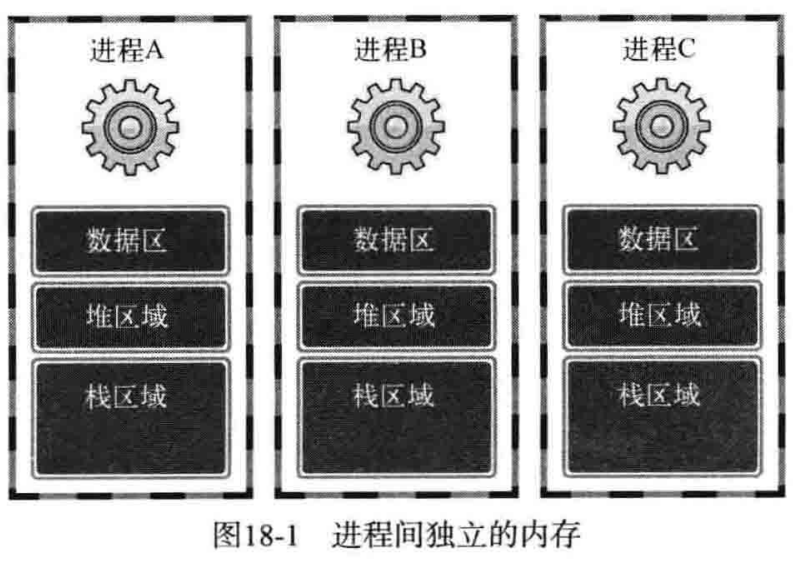

# 线程概念

多进程模型的缺点：
1. 创建进程的开销大。
2. 进程间通信困难。
3. 进程切换开销大（最主要的缺点）。

由于进程的以上缺点，引入了线程。

线程相比进程的优点：
1. 创建线程更快。
2. 线程间通信方便快捷。
3. 线程切换开销小。




## 线程创建及运行

[Example](./thread1.c)

**功能**：创建线程并设置该线程的入口函数，然后运行该线程

```C
#include <pthread.h>

int pthread_create(
    pthread_t *restrict thread, const pthread_attr_t *restrict attr,
    void  *(* start_routinue)(void *), void *restrict arg
);
/*
`thread`：          用于保存新创建的线程`ID`；
`attr`：            用于传递线程属性，当`attr`值为`NULL`，创建默认属性的线程；
`start_routine`：   相当于线程的`main`函数； 
`arg`：             传递`start_routine`函数的参数信息。
*/
```
返回值：成功时返回`0`，失败时返回其他值。

**`restrict`关键字**

`restrict`是`C99`引入的一种类型限定符，它告诉编译器，对象已经被指针所引用，不能通过除该指针外所有其他直接或间接的方式修改该对象的内容。

**注意**：由于`pthread`库不是`Linux`系统默认的库，链接时需要使用静态库`libpthread.a`，所以当使用了线程相关的函数后，在编译时要加`-lpthread`选项以声明需要连接线程库，这样才能调用头文件`pthread.h`中声明的函数。

否则会报错：对`pthread_create`未定义的引用。

## 控制线程的执行流

[example](./thread2.c)

```C
#include <pthread.h>

int pthread_join(pthread_t thread, void  **status);
/*
`thread`：  该参数值`ID`的线程终止后才会从该函数返回
`status`:   保存线程的`main`函数返回值的指针变量地址值
*/
```
返回值：成功时返回`0`，失败时返回其他值。

调用`pthread_join`函数的进程或线程会*进入等待状态*，直到`ID`为`thread`（第一个参数）的线程终止。


# 进程同步

## 互斥量

[Example](./mutex.c)

```C
#include <pthread.h>

// 功能：   创建互斥量。
int pthread_mutex_init(pthread_mutex_t *mutex, const pthread_mutexattr_t *attr);
/*
mutex:  创建互斥量时传递保存互斥量变量的地址值，销毁时传递要销毁的互斥量地址值
attr:   传递即将创建的互斥量属性，没有特别需要指定的属性时则传递`NULL`
*/

// 功能：   销毁互斥量。
int pthread_mutex_destroy(pthread_mutex_t *mutex);
/* 
mutex： 保存将要销毁的互斥量；
*/
```

返回值：成功时返回`0`，失败时返回其他值。


```C
// 若`pthread_mutex_init`第二个参数想传递`NULL`，可以使用宏来直接初始化互斥量。
pthread_mutex_t mutex = PTHREAD_MUTEX_INITIALIZER;  
```

### 加锁和解锁

```C
#include <pthread.h>
int pthread_mutex_lock(pthread_mutex_t* mutex);    // 加锁  返回值：成功时返回`0`，失败时返回其他值。
int pthread_mutex_unlock(pthread_mutex_t* mutex);  // 解锁  返回值：成功时返回`0`，失败时返回其他值。
```


## 信号量

[Example](./semaphore.c)

信号量与互斥量原理相似，但功能更多。

信号量除了以可解决同时访问内存的问题，还可以用来控制线程顺序。

**信号量的创建和销毁**

```C
#include <semaphore.h>

int sem_init(sem_t* sem, int pshared, unsigned int value);
/*
sem：       用于保存创建的信号量
pshared：   取`0`时，创建只允许一个进程内部使用的信号量，取其他值时，创建可由多个进程共享的信号量
value：     要创建的信号量的初始值；
*/

int sem_destory(sem_t* sem);
/*
sem：   保存将要销毁的信号量；
*/
```

返回值：成功时返回 0，失败时返回其他值。


**信号量的`post`和`wait`**

信号量的`wait`和`post`类似互斥量中`lock`和`unlock`函数。

信号量的使用原理：当信号量为`0`时，`sem_wait`函数会阻塞，直到其他线程调用`sem_post`函数使信号量值变为`1`为止。

```C
#include <semaphore.h>

int sem_wait(sem_t* sem);  // 将信号量值减`1`
int sem_post(sem_t* sem);  // 将信号量值加`1`
```


## 销毁线程的两种方法

`Linux`并不会自动销毁由线程创建的内存空间，要使用如下两种方法来**明确销毁线程**：
- 调用`pthread_join`函数。此函数不仅会等待指定的线程终止，还会引导线程销毁。
- 调用`pthread_detach`函数。此函数会将主线程与指定的子线程分离，分离后的子线程执行结束时，资源会自动回收。

理解：`pthread`有`joinable`和`unjoinable`两种状态：
- `joinable`状态：默认状态。当线程函数执行结束时或`pthread_exit`时不会释放线程所占用堆栈和线程描述符等资源。只有当调用了`pthread_join`之后这些资源才会被释放。
- `unjoinable`状态：线程占用的资源会在线程函数退出时或`pthread_exit`时自动释放。`pthread_detach()`函数就是分离线程，即将线程状态转换为`unjoinable`状态，以保证资源的释放。

此外`unjoinable`属性也可以在`pthread_create`时指定。

**pthread_detach**

```C
#include <pthread.h>

int pthread_detach(pthread_t thread);
// 功能：   分离线程，将线程的状态转换为`unjoinable`状态。
// 参数：   `thread`：需要分离的线程`ID`
// 返回值： 成功时返回`0`，失败时返回其他值。
```
